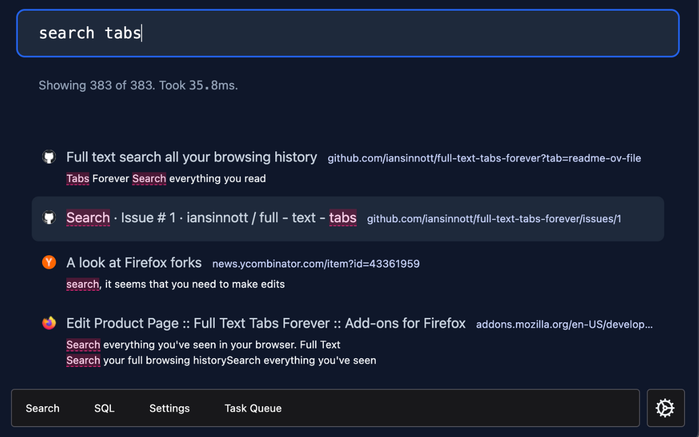

<!-- display a screenshot -->

 

# Full Text Tabs Forever

Search everything you read online. FTTF lets you search the full text of every web page you visit.

Available in the [Chrome Web Store](https://chrome.google.com/webstore/detail/full-text-tabs-forever/gfmbnlbnapjmffgcnbopfgmflmlfghel).

For Firefox support, scroll down.

**Doesn't Chrome do that already? How is this different?**

Chrome does not let you search the text on pages you've visited, only the URLs and titles, and it deletes your history after a number of months.

FTTF is different:

- **Full-Text Search Capabilities:** The full content of every page you've visited becomes searchable.
- **Permanent History:** Your digital footprints are yours to keep. Your data is yours, so it should not be removed without your approval. Nothing is deleted automatically.
- **Instant indexing:** FTTF creates a search index as you browse, so pages are immediately available for searching right after you land on a page.
- **For your eyes only:** Your browsing history is stored locally on your device, and not on any external servers. Beware that if you switch computers your FTTF history will not automatically come with you. It can be exported though.

**Who is it for?**

Data hoarders like myself that never want to delete anything, and want everything to be searchable. More generally, if you've ever felt limited by the standard history search you should try this out.

**How it works:**

Chrome extensions have access to the pages you visit, which lets FTTF make an index of the content on any page. When a page loads its content is extracted and indexed.

Extracted? Yes, or "distilled" if you prefer. Full web pages are huge and have a lot of information that's not related to the content itself. FTTF will ignore all of that. It acts like "reader mode" to find relevant content on a page and only index that.

# Installation

Install in your browser via the [Chrome Web Store](https://chrome.google.com/webstore/detail/full-text-tabs-forever/gfmbnlbnapjmffgcnbopfgmflmlfghel).

# Testing

This project uses `bun` as a unit testing framework, but not (currently) as a bundler. You will need to install `bun`, then:

`bun test`

Or, `pnpm run test` if you prefer.

# Note to self: Submitting a new version manually

> How could this be automated?

- Make sure to bump the version in the manifest file
- Run `n build`
- Go to: https://chrome.google.com/webstore/devconsole/bc898ad5-018e-4774-b9ab-c4bef7b7f92b/gfmbnlbnapjmffgcnbopfgmflmlfghel/edit/package
- Upload the `fttf-chrome.zip` file

# Firefox Support

Support was added in: https://github.com/iansinnott/full-text-tabs-forever/pull/4. As of this writing the extension has not yet been published on the Firefox store, so you will need to clone the repo and build from source. Sorry about that! Maybe by the time you read this it will be added to the store.

# TODO

- [ ] Firefox
      ~~This should not be too difficult since this project was started with web extension polyfills. However, there is currently some chrome specific code.~~
      It appears that the APIs do not have to be rewritten to work in Firefox. See this PR for details: https://github.com/iansinnott/full-text-tabs-forever/pull/4
- [ ] Backfill history
      Currently only new pages you visit are indexed, but we could backfill by opening every page in the browser's history that hasn't yet been indexed. An optional feature, but a useful one.
- [ ] Backup and sync
      As with all my wasm-sqlite projects I don't want data locked in IndexedDB. VLCN has great sync support so this could be relatively low-hanging fruit.
- [ ] Integrate with [browser-gopher](https://github.com/iansinnott/browser-gopher)
      Browser gopher and [BrowserParrot](https://www.browserparrot.com/) were the initial impetus to create a better way to ingest full text web pages, without triggering a Cloudflare captcha party on your home connection.
- [x] Improve discoverability of functionality.
      There is now a button to open the command palette. Still not much GUI, but enough to be discovered.

# Contributing

PRs welcome!
